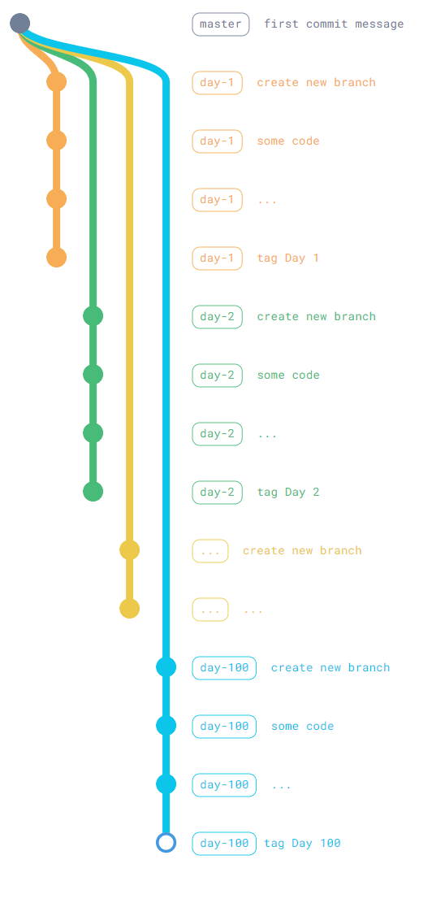

## Bootcamp 100 days of Pyton meets Java

This repo will contain all de work proposed on the '100 Days of Code: The Complete Python Pro Bootcamp'.

The main objective of this is to recreate all this work (whenever possible)
 in Java/Spring, to refresh the fundamentals.

 ### Repo structure 🔱

 The `main` branch will contain the basic structure of each daywork, but it's just the scafolding for the work itself.


<!-- This is for https://tree.nathanfriend.io/ edition

python
  README.md
  config/
    ...
  src
    a.py
    b.py
    x/
      ...
java
  README.md
  config/
    ...
  com
    java
      myapp
        a.java
        b.java
        x/
          ...

Docker
  docker-compose.yml
  Dockerfile
scripts/
  ...
*.env

-->


 ```
.
├── python/
│   ├── README.md
│   ├── config/
│   │   └── ...
│   └── src/
│       ├── a.py
│       ├── b.py
│       └── x/
│           └── ...
├── java/
│   ├── README.md
│   ├── config/
│   │   └── ...
│   └── com/
│       └── java/
│           └── myapp/
│               ├── a.java
│               ├── b.java
│               └── x/
│                   └── ...
├── Docker/
│   ├── docker-compose.yml
│   └── Dockerfile
├── scripts/
│   └── ...
└── *.env
  ```

Each day will have its own separate tag with the following format: `day X - [some description]`. The tag will contain the actual source code of each day exercises both in java and python. The branching strategy will be as follows:



## How to test 🚀

I will be building an index of each day of code (it doesn't mean I will code everyday, or that I will do one day at a time; adult life is demanding, you know 😁). The index will redirect you to the specific tag of that day work. Jus read the README of each tag and follow the instructions!

Disclosure: probably I will f*** up the branches at some points, so expect a possible chaotic git history (not on purpose 😉)

## Index

| Day | Description | Tag | Completed |
| :--------: | -------- | :--------: | :--------: |
| Day 1  | Some description of the work day  | Day 1 - short desc.  | 🟢 |
